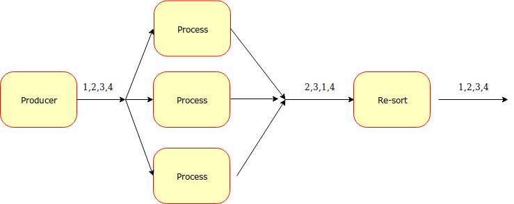

## Go fan out experiment

This is an attempt to tinker with go concurrency paradigms in order to see how to process a flow of messages concurrently while maintaining the order of the results.

Let's imagine a scenario where the ingestion order matters (actions on stock markets, for example) but processing each event has a high cost (imagine hitting a remote endpoint for validation) that does not depend on the previous messages. What I wanted to achieve here is a way to maximize the throughput by taking advantage of go powerful concurrency system while maintaining the order that the events exit from the machinery.

### Unordered processing

It's really easy to process events concurrently, just by spinning up many go routines reading from the same channel. The order in which the results are processed and spit out might not be the same as the one incoming.

### Ordered processing

Instead of just one worker, I put many in place. Each worker reads from the same channel, and write the results on another channel.
There is then another goroutine that reads from that channel, re-orders the results and spits them out (on stdoutput). 

Working examples can be found in fast / slow folders of this repo.

### Notes
The "reordering" part is really simple and could be optimized a lot, reducing gc by adding a circular buffer and / or sorting the slice.